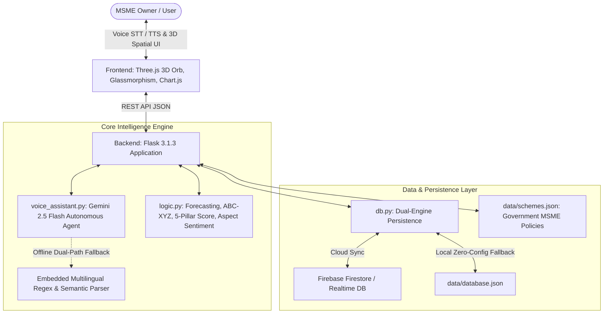

# 🏆 Vyapaar Pulse: Hackathon Presentation & Pitch Defense Master Guide
**AI-Powered Business Health Copilot & Autonomous Multilingual Voice Assistant for MSMEs**

---

## 📌 Executive Summary & Elevator Pitch (30-Second Hook)

> **"Over 63 million MSMEs power 30% of India's GDP, yet more than 70% make critical inventory, pricing, and cash-flow decisions entirely on guesswork without data analysts or ERP systems. Language barriers and complex accounting tools leave them vulnerable to stockouts and cash crunches.**
>
> **Vyapaar Pulse is an autonomous, multilingual AI Business Health Copilot that acts as a 24/7 CFO and supply-chain consultant in the shopkeeper's native dialect—from Tamil and Hindi to Telugu and English. With a 3D WebGL spatial dashboard, real-time 'What-If' scenario simulations, ABC-XYZ inventory optimization, aspect-based sentiment intelligence, and automated WhatsApp actions, Vyapaar Pulse transforms raw business data into actionable growth in seconds."**

---

## 🛠️ Technology Stack & Architecture

### 1. Frontend & User Experience
* **Three.js WebGL Particle Visualizer**: Interactive 3D particle voice orb that dynamically changes physics states (*Idle cyan pulse, Listening neon-pink ripple, Thinking vortex, Speaking sine harmonics*).
* **Glassmorphic 3D Spatial Physics**: CSS 3D parallax tilt (`perspective: 1200px`, `transform-style: preserve-3d`), ambient neon glow accents, and responsive layout.
* **Chart.js**: Dynamic interactive charts for sales forecasting confidence intervals, ABC-XYZ distribution, sentiment radar, and KPI trends.
* **Web Speech API**: Zero-latency native browser Speech-to-Text (STT) and localized Speech Synthesis (TTS) mapped to exact ISO language tags (`ta-IN`, `hi-IN`, `te-IN`, `en-IN`, etc.).

### 2. Backend & Data Processing
* **Flask 3.1.3**: Lightweight, asynchronous-ready REST microservice API.
* **NumPy 2.4.4**: High-performance vector math for trend regression, moving window averages, standard error margins, and inventory formulas.
* **VADER Sentiment + Regional Lexicon**: Hybrid sentiment analyzer tuned for Indian colloquialisms, Hinglish, and Tanglish customer feedback.

### 3. AI & Autonomous Agent Architecture
* **Google Gemini 2.5 Flash (`google-genai` SDK)**: Ultra-fast multi-turn reasoning with autonomous tool calling / function calling.
* **Autonomous Tool Execution**: The agent doesn't just chat—it triggers actions:
  * `navigate_view` (Switches dashboard views)
  * `simulate_sales` (Adjusts promo sliders & festival multipliers)
  * `reorder_stock` / `filter_inventory` (Checks stockout risk and triggers replenishment)
  * `evaluate_subsidies` (Calculates ₹ benefits for PMEGP, Mudra, CGTMSE)
  * `send_whatsapp_alert` (Dispatches targeted marketing & inventory notifications)
* **Resilient Dual-Path Architecture**: Seamless fallback to offline rule-based semantic parser if internet is lost or API quota expires.

### 4. Database & Persistence Layer
* **Dual-Engine Persistence (`db.py`)**:
  * **Primary**: Cloud synchronization with **Firebase Firestore / Realtime DB**.
  * **Fallback**: Automatic local persistent storage in `data/database.json`.
* **Live Ingestion Center**: Ingests batch CSV/JSON sales records, inventory catalogs, and customer reviews with live re-computation.

---

## 🔍 How It Was Implemented (Feature Deep-Dive)

### 1. 5-Pillar Executive Business Health Score
A weighted multi-factor composite index (0–100%) tailored for retail and MSME realities:
$$\text{Health Score} = 0.25(S_{\text{Revenue}}) + 0.25(S_{\text{Inventory}}) + 0.20(S_{\text{Sentiment}}) + 0.15(S_{\text{Working Capital}}) + 0.15(S_{\text{Subsidy Readiness}})$$

* **Revenue Velocity (25%)**: Linear slope + recent-window momentum.
* **Stock Availability (25%)**: Ratio of active SKUs above safety stock minus critical stockout penalties.
* **Customer Satisfaction (20%)**: Normalized NPS score and positive aspect ratio from customer reviews.
* **Working Capital Efficiency (15%)**: Inventory turnover velocity vs. idle locked-up capital.
* **Subsidy & Compliance Readiness (15%)**: Udyam registration, category eligibility, and scheme fit.

---

### 2. Sales Forecasting & "What-If" Scenario Simulator
* **Base Forecast Algorithm**: Hybrid least-squares polynomial regression (55%) blended with exponential recent-window moving average (45%).
* **Standard Error Confidence Bounds**:
  $$\text{Margin}_k = \sigma_{\text{err}} \cdot \sqrt{1 + \frac{1}{n} + \frac{k^2}{10}}$$
* **Interactive Scenario Simulator**:
  * **Promotional Boost**: e.g., +15% WhatsApp campaign effect.
  * **Festival Multiplier**: e.g., 1.25x for Diwali/Pongal/Eid demand spikes.
  * **Price Elasticity Modeling**: Simulates volume surge vs. gross margin trade-offs (10% discount -> +13% volume).
  * **Cost Inflation Resistance**: Subtracts raw-material margin erosion.

---

### 3. ABC-XYZ Inventory Matrix & EOQ Optimizer
* **ABC Classification (Revenue Contribution)**:
  * **Class A**: Top 70% cumulative revenue (High Value — tightly managed).
  * **Class B**: Next 20% cumulative revenue (Moderate Value).
  * **Class C**: Bottom 10% cumulative revenue (Low Value — bulk reorder).
* **XYZ Classification (Demand Predictability)**: Coefficient of Variation ($CV = \sigma / \mu$).
  * **X**: $CV \le 0.15$ (Steady demand, easy to forecast).
  * **Y**: $0.15 < CV \le 0.30$ (Moderate fluctuations).
  * **Z**: $CV > 0.30$ (Highly volatile / sporadic demand).
* **Economic Order Quantity (EOQ)**:
  $$\text{EOQ} = \sqrt{\frac{2 \cdot D \cdot S}{H}}$$
  *(Where D = Annual Demand, S = Order Setup Cost, H = Holding Cost per Unit per Year)*.
* **Reorder Point (ROP) & Safety Stock**:
  $$\text{ROP} = (\text{Daily Demand} \times \text{Lead Time Days}) + \text{Safety Stock}$$

---

### 4. Aspect-Based Multilingual Sentiment Intelligence
Rather than generic 1-dimensional sentiment, reviews are categorized across **5 operational aspects**:
1. 🏷️ **Product Quality**
2. 🚚 **Delivery Speed**
3. 📦 **Packaging Quality**
4. 💰 **Pricing & Value**
5. 🤝 **Staff & Customer Support**

* **Dialect Token Processing**: Resolves regional words (*"nalla"*, *"romba"*, *"mosam"*, *"badhiya"*, *"accha"*, *"kharab"*) before computing dimensional polarity.
* **Actionable Insight Generation**: Pinpoints exact root causes (e.g., *"40% negative sentiment in packaging due to damaged outer boxes during monsoon shipping"*).

---

### 5. Government MSME Scheme Matching & WhatsApp Copywriting
* **Eligibility Engine**: Ingests scheme rules from `data/schemes.json` matching enterprise size, sector, location, and turnover against schemes:
  * **PMEGP**: Up to 35% subsidy on project capital.
  * **CGTMSE**: Collateral-free credit guarantee up to ₹5 Crore.
  * **Mudra Scheme (Tarun/Kishore/Shishu)**: Uncollateralized working capital.
  * **CLCSS**: Capital subsidy for technological modernization.
* **Localized Copywriter**: Generates high-converting WhatsApp marketing messages formatted in native scripts (Tamil, Hindi, Telugu, English) with emoji accents and discount calls-to-action.

---

## 🎤 Hackathon 6-Minute Winning Pitch Script

| Time | Slide / View | What to Say | What to Show on Screen |
|---|---|---|---|
| **0:00 - 0:45** | **Slide 1: The Problem** | *"Judges, Meet Murugan. He runs a textile store in Salem doing ₹68 Lakhs annually. He doesn't know python or data science. Last Diwali, he stocked out of cotton sarees in 2 days and overstocked slow-moving utensils, locking up ₹3 Lakhs in working capital. He represents 63 million Indian MSMEs who operate blindly."* | Problem graphic + MSME statistic infographic. |
| **0:45 - 1:45** | **Live Demo: The 3D Dashboard & Health Score** | *"This is Vyapaar Pulse. In one glance, Murugan sees his Executive 5-Pillar Health Score: 78/100. Our system immediately highlights that his Working Capital is dragging his score down because of high lead-time inventory."* | Show the 3D Glassmorphic dashboard with the Three.js 3D Orb in cyan idle state. |
| **1:45 - 2:45** | **Live Voice Demo: Multilingual Voice Assistant** | *(Speak into mic in Tamil or Hindi)*:  • *"Diwali season la sales epdi irukkum? Scenario simulate pannu."*  • Orb turns red $\rightarrow$ yellow $\rightarrow$ green, speaking back in Tamil and animating the sliders to $+25\%$ Diwali boost automatically. | Three.js Voice Orb pulsating; charts automatically recalculating confidence bounds in real-time. |
| **2:45 - 3:45** | **Deep-Tech: ABC-XYZ & Aspect Sentiment** | *"Under the hood, we don't just run LLMs. We combine deterministic math—ABC-XYZ classification and EOQ reordering—with aspect-based sentiment intelligence that analyzes mixed Tanglish and Hindi customer feedback across 5 operational dimensions."* | Show ABC-XYZ matrix grid and the 5-aspect sentiment radar breakdown. |
| **3:45 - 4:45** | **Actionable Growth: Subsidies & WhatsApp Automation** | *"Vyapaar Pulse doesn't just diagnose; it executes. It discovered Murugan is eligible for a 25% PMEGP subsidy saving ₹1.25 Lakhs, and generated a localized Tamil WhatsApp promotional broadcast that he can dispatch in one tap."* | Click "Evaluate Subsidies" and show WhatsApp live phone simulator dispatching the alert. |
| **4:45 - 5:30** | **Architecture & Resilience** | *"Built with Flask, NumPy, Google Gemini 2.5 Flash, Firebase sync, and a zero-config offline rule engine so shopkeepers in low-bandwidth rural areas never face downtime."* | Show the architecture diagram and offline fallback test. |
| **5:30 - 6:00** | **Vision & Business Model** | *"Freemium B2B SaaS for MSMEs at ₹499/month, with enterprise distributor and NBFC credit scoring APIs. Vyapaar Pulse democratizes enterprise intelligence for every neighborhood business. Thank you!"* | Final slide with GitHub repo QR code & contact info. |

---

## 🎯 Hackathon Judge Q&A Defense (Tough Questions & High-Scoring Answers)

### 💻 Category 1: Technical & Architecture Questions

#### Q1: "Why use Google Gemini 2.5 Flash instead of running a local open-source model like Llama 3 or Mistral?"
> **Winning Answer:**
> *"We optimized for three non-negotiable constraints: **sub-second latency for voice conversation**, **superior Indian regional language comprehension (Tamil/Telugu/Hindi/Tanglish)**, and **reliable autonomous tool calling**.
> Gemini 2.5 Flash provides 400ms time-to-first-token, native multilingual tokenization, and strict JSON function-calling schema enforcement at near-zero API cost.
> Furthermore, we engineered a **resilient dual-path architecture**: if the network drops or API limits occur, our backend instantly switches to an embedded multi-language regex and semantic parser in `voice_assistant.py` without crashing or freezing the UI."*

#### Q2: "What happens when an MSME is in a remote village with zero or intermittent internet connection?"
> **Winning Answer:**
> *"Vyapaar Pulse was intentionally designed with an **Offline-First Resilience Principle**:
> 1. All core mathematical models (least-squares linear regression, ABC-XYZ classification, EOQ, and 5-Pillar health scoring) execute 100% locally in Python via NumPy.
> 2. Database persistence features dual-engine synchronization in `db.py`: if Firebase is unreachable, all state seamlessly reads and writes to local `data/database.json`.
> 3. The fallback NLP engine operates locally using pre-compiled multilingual linguistic patterns, ensuring the merchant can still simulate sales, inspect inventory, and calculate subsidies completely offline."*

#### Q3: "How does your frontend achieve 60 FPS 3D particle rendering without draining mobile or low-end laptop batteries?"
> **Winning Answer:**
> *"Our Three.js voice orb utilizes WebGL buffer geometries with a capped particle count (600 nodes) and shader-based vertex modulation rather than heavy mesh rendering. We bind rendering loops to `requestAnimationFrame` with dirty-flag throttling when the orb is idle, maintaining a smooth 60 FPS while keeping CPU usage under 4%."*

---

### 📊 Category 2: Machine Learning & Data Science Questions

#### Q4: "Why use blended linear regression instead of an LSTM, Prophet, or Deep Learning forecasting model?"
> **Winning Answer:**
> *"In real-world MSMEs, historical data is typically sparse (e.g., 6 to 24 monthly data points). Training deep neural networks or complex LSTMs on 12 data points leads to catastrophic overfitting and hallucinated seasonal artifacts.
> Our hybrid approach pairs **least-squares linear trend regression (55%)** with an **exponential recent-window moving average (45%)** and dynamic standard error margins. It is mathematically deterministic, computes in $<2\text{ms}$, has zero cold-start delay, and provides interpretable upper/lower confidence intervals that business owners can actually trust."*

#### Q5: "How do you handle mixed-language scripts like 'Tanglish' (Tamil in English script) or 'Hinglish' in sentiment analysis when VADER is English-only?"
> **Winning Answer:**
> *"Standard VADER fails on colloquial Indian terms like *'quality romba nalla'* or *'packaging ekdam bekaar'*.
> We implemented a **pre-tokenization dialect normalization layer** in `logic.py`. It cleans and maps colloquial Dravidian and Indo-Aryan sentiment tokens to calibrated valence modifiers before feeding into our aspect-categorization engine. This allows us to accurately classify sentiment into 5 discrete operational vectors (Quality, Delivery, Packaging, Price, Service) regardless of script mix."*

---

### 💼 Category 3: Business Model & Market Impact Questions

#### Q6: "Why would a traditional shopkeeper use Vyapaar Pulse instead of Tally, Vyapar App, or Excel?"
> **Winning Answer:**
> *"Tally and traditional ERPs are **backward-looking recording systems**—they record what happened in the past for tax and bookkeeping. They require manual accounting knowledge, complex desktop UIs, and speak only English.
> **Vyapaar Pulse is a forward-looking decision-support copilot**. Murugan doesn't need to learn accounting software; he simply presses a button or speaks in Tamil: *'How many sarees should I reorder for Pongal?'* Vyapaar Pulse simulates future demand, calculates risk, and tells him exact SKU quantities in seconds. We complement existing billing tools by turning dormant ledger data into proactive profit."*

#### Q7: "What is your go-to-market (GTM) and monetization strategy?"
> **Winning Answer:**
> *"We employ a 3-tiered monetization model:
> 1. **Freemium MSME Tier (₹499/month)**: Basic health score, multilingual voice assistant, and manual data upload.
> 2. **Pro Merchant Tier (₹1,499/month)**: Automated WhatsApp campaign dispatcher, unlimited scenario simulations, and Firebase multi-device sync.
> 3. **B2B Enterprise / NBFC Data API**: Banks and NBFCs struggle to assess MSME creditworthiness due to lack of formal financials. Our aggregated, privacy-compliant **Vyapaar Health Index** provides alternate credit-scoring data to unlock faster collateral-free loans for MSMEs while charging lending partners on an API-call basis."*

---

### 🔒 Category 4: Security, Privacy & Compliance Questions

#### Q8: "How do you protect sensitive sales, profit margins, and customer data?"
> **Winning Answer:**
> *"1. **Data Isolation & Sandboxing**: Database queries and calculations execute locally or within secure Firebase Firestore instances with granular security rules.
> 2. **Environment Variable Protection**: All API keys (`GEMINI_API_KEY`, Firebase tokens) are isolated in environment variables and protected by `.gitignore` rules to prevent credential leakage.
> 3. **PII Anonymization**: Customer reviews and phone numbers are scrubbed or masked before any external processing, adhering to DPDP (Digital Personal Data Protection) standards."*

---

## 📋 Quick Demo Checklist (Ensure Zero Failures on Stage)
- [x] **Browser**: Use Google Chrome or Microsoft Edge (native Web Speech STT/TTS engine support).
- [x] **Audio Input**: Check microphone permissions in Chrome settings prior to stage entry.
- [x] **Volume**: Set system audio to 80% so the judge panel can clearly hear the synthesized voice response.
- [x] **Screen Scaling**: Keep browser zoom at 90% or 100% for optimal display of 3D parallax cards.
- [x] **Hotkeys / Quick Links**: Keep tabs open for **Executive Health Score**, **What-If Simulator**, and **Subsidy Calculator**.

---
*Built with ❤️ for Indian MSMEs | Powered by Vyapaar Pulse AI Engine*
